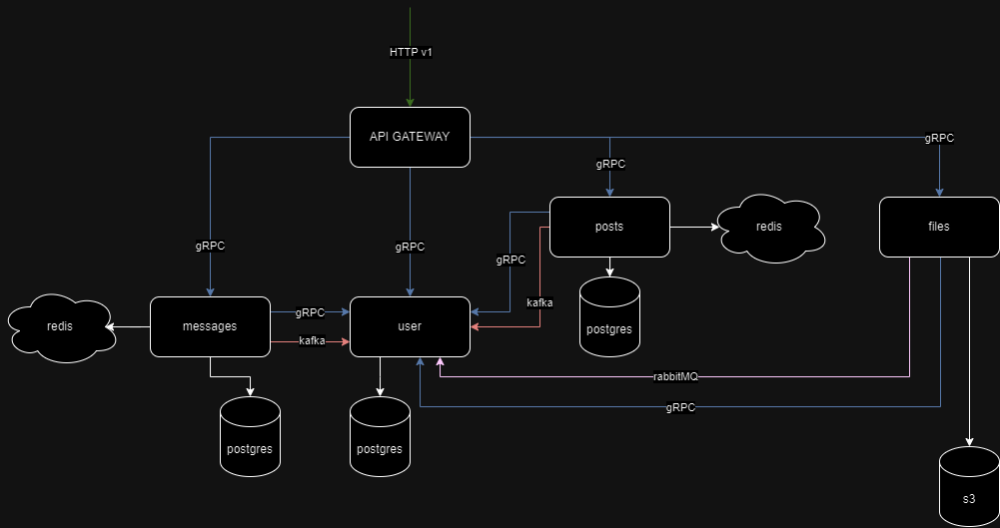

# Chatter - is a Golang realization of social network.

### Backend Tech Stack:
- PostgreSQL
- S3
- HTTP/Fiber
- gRPC
- Redis(Caching)
- Kafka
- RabbitMQ
- Docker
- JWT Authentication

#### Features
- Project is built according to Bob Bowman's clean architecture.
- Microservice architecture.
- Caching data and message queuing are included.

---

